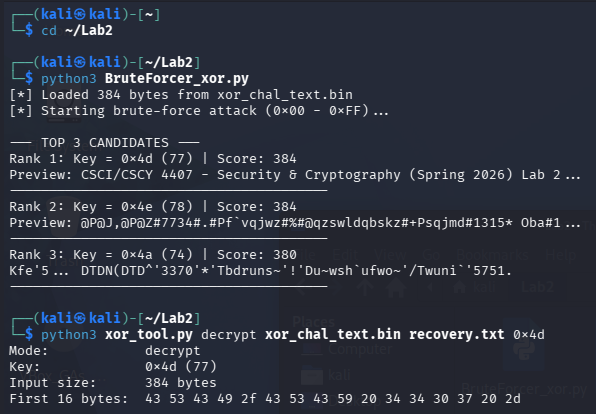
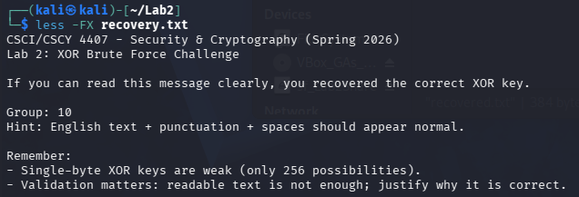
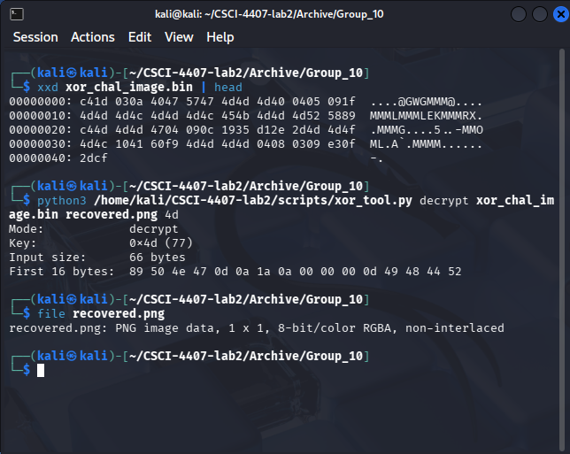

# Lab 2 — Modular Arithmetic and XOR-Based Encryption

**Course:** Security & Cryptography
**Date:** 02/16/2026
**Group Members:** Matthew Kenner, Cassius Kemp, Jonathan Le

---

## Task 1 — Build XOR Tool (20 pts)

### Source Code

```python
#!/usr/bin/env python3
"""Task 1 — XOR Encryption/Decryption Tool"""

import sys


def xor_file(mode, input_path, output_path, key):
    """XOR each byte of input file with key and write to output."""
    with open(input_path, "rb") as f:
        data = f.read()

    result = bytes(b ^ key for b in data)

    with open(output_path, "wb") as f:
        f.write(result)

    first16 = result[:16].hex(" ")
    print(f"Mode:            {mode}")
    print(f"Key:             0x{key:02x} ({key})")
    print(f"Input size:      {len(data)} bytes")
    print(f"First 16 bytes:  {first16}")


def main():
    if len(sys.argv) != 5:
        print(f"Usage: {sys.argv[0]} encrypt|decrypt <input> <output> <hex_key>")
        sys.exit(1)

    mode = sys.argv[1]
    input_path = sys.argv[2]
    output_path = sys.argv[3]
    key = int(sys.argv[4], 16)

    xor_file(mode, input_path, output_path, key)


if __name__ == "__main__":
    main()

```

### Screenshots


### Explanation of XOR Symmetry

XOR encryption and decryption use the same operation because XOR is self-inverse, meaning applying the same XOR operation twice with the same key restores the original data.

```
(P XOR K) XOR K
= P XOR (K XOR K)
= P XOR 0
= P
```
### Questions (1-9)

1. The encryption key is provided as a hexadecimal string (e.g., e7). Explain why this value must first be converted into an integer before applying the XOR operation.  

	Computers perform the XOR operation on binary numbers (So that bits can be selected base on the XOR criteria) not on text characters. The key "e7" is a smiple hexadecimal representation using two characters (e and 7, Both of which can be used in XOR in their current state). To perform a bitwise XOR operation the program must convert the "e7" into the binary value it is equivalent so it can change the bits needed.  

2. What is the decimal value of the hexadecimal key e7? Why must this decimal value be used during the XOR operation instead of the string "e7"?  

   	Numerical Value (Decimal): (14 × 16^(1)) + (7 × 16^(0)) = 224 + 7 = 231.
	The XOR operation works at the bit level therefore it can't process deciaml or hex values only their binary equivalents. The decimal value 231 equals the binary sequence 11100111 and 231 is equivalent to e7! If you used the hex value "e7" your computer would see two separate bytes (ASCII e = 101, ASCII 7 = 55) and this would cause an error to occur with our XOR operation.  

3. What would occur if you attempted to XOR a byte directly with the string “e7” without converting it to an integer?  

	In Python this would cause a TypeError, this is because it cannot perform bitwise operations between an integer and a string(e and 7). The program would lock up and not complete the operation as it cant perform the XOR operation.  

4. When encrypting a file, your program prints output similar to.  
	Mode: encrypt  
	Key: 0xe7  
	Input size: 17 bytes  
	First 16 output bytes (hex): ...  
	
	Explain the meaning of each of the followinf fields:  
	
	Mode  
	Key  
	Input size  
	First 16 output bytes  

    Mode: Indicates the operation being performed by the program (either encryption or decryption).  
    Key: The hexadecimal version of the key (value used to encrypt and decrypt) used to change the plaintext into ciphertext (and vice versa).  
    Input size: The total length of the file being processed in bytes.  
    First 16 output bytes: A hex preview of the encrypted or decrypted data, This provides the with visual to verify that the data has been modified properly.  

5. Demonstrate mathematically why XOR is symmetric, i.e., why:  
   
	(P⊕K)⊕K=P.

	XOR has two critical properties:
    	Self-Inverse: Any value computed by the XOR operation that is XOR'd byitself turns into zero (K⊕K=0).  
    	Identity: Any value that is XOR'd with zero remains unchanged (P⊕0=P).  

	Examples from Cryptography:  
		Ciphertext = P ⊕ K  
		Decryption = (P ⊕ K) ⊕ K  
		Associative Property = P ⊕ (K ⊕ K)  
		Self−Inverse = P ⊕ 0  
		Identity = P  

6. Using ASCII values, manually compute the encryption of the first character of your plaintext file using the key e7. (hello.txt)

    ASCII value of the character ('H'): 72  

    Binary representation of the character: 01001000  

    Binary representation of the key (e7): 11100111  

    Resulting ciphertext byte in binary:  

    01001000 (Plaintext 'H')  
    11100111 (Key e7)  
	---------------------------  
	XOR OPERATION  
	---------------------------  
    10101111 (Result)  
	
	Split into Bytes: 1010 1111  

    Ciphertext in hexadecimal: af  

    (Binary 1010 = Hex a, Binary 1111 = Hex f)  

7. Compare your manual computation with the first byte shown in the encryption output. Do they match? Explain why.  
	They should match exactly, our program performs the exact XOR operation that I completed in Question 6.  

8. How many possible keys exist in a single-byte XOR encryption system?  
	There are 256 possible keys, since a single byte consists of 8 bits (2^(8)) the range is 0x00 to 0xFF.  

9. Explain why a small key space makes this encryption method vulnerable to brute-force attacks.  
	A key space of 256 is massively small for modern computing capabilities a proper bruteforce attack involves trying every possible key till the correct key is found or just every single one possible. An average laptop can even test billions of keys per second therefore, testing only 256 keys takes a fraction of a microsecond meaing an attacker without question can decrypt the message without knowing the key originally.

---

## Task 2 — Break XOR via Brute Force (25 pts)

### Source Code

```python
#!/usr/bin/env python3
"""Task 2 — Brute Force Single-Byte XOR"""

import sys

def get_PlainTextScore(data):
    """
    Calculates a score for a byte string based on character frequency.
    Higher score = more likely to be plain text.
    """
    Score = 0
    #ASCII range: space (32) to tilde (126)
    #Whitespace: tab (9), newline (10), carriage return (13)

    for byte in data:
        #Checks if our byte is printable or common whitespace
        if (32 <= byte <= 126) or byte in [9, 10, 13]:
            Score += 1

        #Characters that don't often appear in text (Something like null bytes) will negatively increment the score to filter the data.
        elif byte < 32 or byte > 126:
            Score -= 1

    return Score

def main():
    Filename = 'xor_chal_text.bin'

    #Reads the ciphertext file
    try:
        with open(Filename, 'rb') as f:
            Ciphertext = f.read()
    except FileNotFoundError:
        print(f"Error: Could not find '{Filename}'.")
        print("Make sure the file is in the same directory as this script.")
        sys.exit(1)

    print(f"[*] Loaded {len(Ciphertext)} bytes from {Filename}")
    print("[*] Starting brute-force attack (0x00 - 0xFF)...\n")

    Candidates = []

    #Try every possible key from 0 to 255
    for key in range(256):

        #Decrypt the data with the current key
        DecryptedData = bytes([b ^ key for b in Ciphertext])
        #Scores our result
        Score = get_PlainTextScore(DecryptedData)
        #Stores the data: (Score, key, DecryptedData)
        Candidates.append((Score, key, DecryptedData))

    #Sorts the candidates by their score (highest score is listed first)
    Candidates.sort(key=lambda x: x[0], reverse=True)

    #Print the Highest scoring 3 results
    print("--- TOP 3 CANDIDATES ---")
    for i in range(3):
        Score, key, Plaintext = Candidates[i]

        #Converts the  bytes to a string for display
        Preview = Plaintext[:60].decode('utf-8', errors='replace').replace('\n', ' ')
        print(f"Rank {i+1}: Key = {hex(key)} ({key}) | Score: {Score}")
        print(f"Preview: {Preview}...")
        print("-" * 40)

if __name__ == "__main__":
    main()
```

### Recovered Key

**Key:** [0x4d]

### Recovered Plaintext

```
CSCI/CSCY 4407 - Security & Cryptography (Spring 2026)
Lab 2: XOR Brute Force Challenge

If you can read this message clearly, you recovered the correct XOR key.

Group: 10
Hint: English text + punctuation + spaces should appear normal.

Remember:
- Single-byte XOR keys are weak (only 256 possibilities).
- Validation matters: readable text is not enough; justify why it is correct.
```

### Screenshots





### Explanation of Scoring Logic

The scoring function uses a frequency detection method to score the results of using each encryption key. The file sorts out non-regular characters (like null characters) as it iterates through the encrypted text giving a negative score each time it comes across one. At the same time while iterating through the string, when a character in the ASCII range of 32 - 126 it is considered printable and is give a positive score. This means that when we find the correct key it should have the highest score as it has the most printable characters of the different stings. However, some other keys may provide the same score as the correct key, which is why we include a preview of the decrypted text to let the user find the correct key.


### Questions (1-12)

1. Explain why a single-byte XOR encryption scheme is vulnerable to brute-force attacks.

	Single byte XOR schemes are vulnerable because their key spaces are incredibly small. As our key is only 8 bits in lenght there are only 256 possible combinations for which that key can be. Modern computers can generate and analyze 256 possibilities in fractions of a millisecond, making it trivial to try every single key to find the correct one.

2. How many possible keys exist in a single-byte XOR system? Show the mathematical reasoning.

	There are only 256 possible keys. A single byte consists of 8 bits and each bit can be a 0 or a 1 but not both.
    The range is from 00000000 (0) to 11111111 (255); and remember we start at 0, so 0 - 255 is 256 bits.   
	Calculation: 2^(8) = 256

3. Describe the approach used in your brute-force script. Your explanation must include:

    The bruteforce script uses a loop to iterate through the integers from 0 to 255. Inside the loop, the bruteforce script takes the current candidate key and performs a XOR operation against all bytes of the ciphertext to produce a candidate plaintext (these are temporary). The script then passes our candidate plaintext to the scoring function, the scoring function counts the number of valid printable ASCII characters to assign a score to that attempt at decryption.

4. Explain the purpose of the scoring function in your brute-force script. Why is scoring necessary instead of simply printing all 256 results?

	The scoring function automates the analysis process, a person could theoretically manually read 256 outputs to find the plain text but that is impractical. The scoring function filters out the encrypted outputs and highlights the outputs that score highly and therefore "resembles" English text as the top of our candidate list.

5. What characteristics make English plaintext distinguishable from random byte sequences?

    English text uses almost exclusively ASCII values from the 32 to 126 range (letters, numbers, punctuation, etc.). Random bytes that are used for encryption use the full 0–255 range instead of the limited range that printable English uses. English has a specific letter frequency aswell, it's distributed (e, t, a, and o are very common; but z and q are quite rare) in specific patterns that are easy to recognize. These patterns are typically common words and common phrases, random data bits cannot replicate this data through standard methods.

6. The script outputs the “Top 5 Candidates.” Why might multiple keys produce partially readable output?

	At times, a non-correct key might have the bits that are very similar to the correct key. When this is used for XOR, this non-correct key might shift certain letters to valid letters (shifting an 'a' to a 'f') or special characters/punctuation all of this is by chance. While the text won't make sense or won't be the correct text, it might contain enough valid ASCII characters to trick our scoring algorithm into giving it a score, that places it in the top 3.

7. Report the recovered key in hexadecimal format. Show the best-ranked output and explain why it is correct.

    Key: 0x4d
    Output: Rank 1: Key = 0x4d (77) | score: 384
			Preview: CSCI/CSCY 4407 - Security and Crytography (Spring 2026) Lab 2 ...

    Reasoning: This is the correct output because we can read completely readable sentences that make sense in their context, all of the other key candidates produced unreadable binary text instead of readable text.

8. Verify your recovered key using your XOR tool from Task 1. Provide evidence that decrypting the ciphertext using the recovered key produces the correct plaintext.

	

    Evidence: The decryption produced a file when opened that contained the exact initial sentence found by the brute-force script, along with the rest of the readable text that makes sense with the context of the other sentences.
	
	recovery.txt contents:
		
		CSCI/CSCY 4407 - Security & Cryptography (Spring 2026)
		Lab 2: XOR Brute Force Challenge

		If you can read this message clearly, you recovered the correct XOR key.

		Group: 10
		Hint: English text + punctuation + spaces should appear normal.

		Remember:
		- Single-byte XOR keys are weak (only 256 possibilities).
		- Validation matters: readable text is not enough; justify why it is correct.

9. Why is key entropy important in cryptographic systems? Discuss in the context of this task.

	Entropy is the measure of randomness and unpredictability, the key we used had very low entropy (only 8 bits of uncertainty). This made the correct key very easy to guess through bruteforce, secure systems (Ex. servers for buisnesses or online chatting platforms) require keys with high entropy (128 or 256 bits of truly random data) this ensures that the number of possible keys is too massive for the value of the data to be worth it for the attacker to extract.

10. Suppose the key length were increased from 1 byte to 16 bytes. How would this change the feasibility of brute-force attacks? Support your answer mathematically.

	Increasing the key to 16 bytes makes a brute-force attack computationally impossible with the current hardware, especially when considering running in a VM.  
    Math: A 16-byte key is 128 bits (16x8). The key space becomes 2^(128). 2^(128)≈3.4×10^(38) possible keys.  
    This is a computationally impossible task to tackle for any attacker during their lifetime. This would mean that the attacker would need to use other methods to extract the data.

11. If the plaintext contained only binary data (e.g., compressed file instead of English text), would the scoring approach still work effectively? Explain why or why not.

	No, the current scoring function would fail very very badly. Compressed files (like .zip or .png) look like highly random data and they do not contain words that follow the frequency distribution of English. You would need to completely change the scoring system in order to perform any type of brute force attack, like using the file headers and other aspects.

12. Reflect on this attack: What does this task demonstrate about the difference between theoretical security and practical implementation?

	Theoretically, the XOR operations to use for encryption are quite secure. However, they can be greatly restricted by short keys and other low security parameters making them not a good idea to implement by themselves. If you were to add more secure methods on top of the XOR encryption you can create a very secure key system.

---

## Task 3 — Image Header Attack (20 pts)

### Key Recovery Explanation

**Known PNG header bytes:** `89 50 4E 47 0D 0A 1A 0A`

**First encrypted byte(s):** `c4 1d 03 0a 40 47 57 47`

**Recovered key:** 0x4d


To recover the key, we used the known PNG file signature. Every valid PNG file begins with the fixed 8-byte header:

89 50 4E 47 0D 0A 1A 0A

Since the encryption method was single-byte XOR, the relationship between plaintext (P), ciphertext (C), and key (K) is:

C = P ⊕ K

To recover the key, we rearrange the equation:

K = C ⊕ P

Using the first byte:

C₀ = 0xC4  
P₀ = 0x89  

Compute:

0xC4 ⊕ 0x89 = 0x4D

This reveals the key used for encryption was:

K = 0x4D

To verify correctness, we XORed additional ciphertext bytes with 0x4D and confirmed they reproduced the correct PNG header values. After decrypting the entire file using key 0x4D, the output was identified as a valid PNG image.


### Source Code

```python
cipher_byte = 0xC4
plain_byte = 0x89
key = cipher_byte ^ plain_byte
print(hex(key))
```

### Verification Screenshots



[INSERT SCREENSHOT: Decrypted PNG image opened successfully]

### Explanation of Known-Plaintext Attack

This attack succeeds because part of the plaintext is predictable. The PNG file format has a fixed and publicly known header. Since XOR encryption is reversible, knowing even one plaintext byte allows direct recovery of the key:

K = C ⊕ P

Because the same single-byte key was reused across the entire file, recovering the key from just one known byte allowed complete decryption of the ciphertext.

This demonstrates a fundamental weakness of simple XOR encryption:

If the key is reused, security collapses.

If plaintext contains predictable structure, it becomes vulnerable to known-plaintext attacks.

XOR provides no security when small key spaces or repeated keys are used.

Even partial knowledge of plaintext completely compromises the encrypted file.

---

Questions: Image Header Attack (Known-Plaintext Attack, KPA)
1. What is a known-plaintext attack? Define it clearly and explain how it applies to this
task.

A known-plaintext attack (KPA) is when an attacker knows part of the original plaintext and uses that information to recover the encryption key or additional plaintext.

In this task, we knew that the encrypted file was supposed to be a PNG image. PNG files always begin with a fixed 8-byte header. Since we knew those first 8 plaintext bytes, we could XOR them with the first 8 ciphertext bytes to recover the encryption key.

2. Why do PNG files provide an advantage to an attacker in this scenario? What property
of the PNG format makes key recovery possible?

PNG files have a fixed and publicly defined header. Every PNG file starts with the same 8 bytes. This predictable structure gives the attacker known plaintext at the beginning of the file.

Because XOR encryption is reversible, knowing even one plaintext byte allows direct recovery of the key if the same key is reused.

3. Write the hexadecimal representation of the standard PNG file header. Why is this
header fixed across all PNG files?

89 50 4E 47 0D 0A 1A 0A
This header is fixed across all PNG files because it identifies the file format and ensures compatibility across systems. It acts as a file signature.

4. Let the first byte of the ciphertext be C0. Show mathematically how the XOR key can
be recovered using:
K= C0 ⊕ 0x89
Explain why this works.

Let:

C₀ = first ciphertext byte
P₀ = first plaintext byte = 0x89

We know:

C₀ = P₀ ⊕ K

Rearrange to solve for K:

K = C₀ ⊕ P₀

Since P₀ = 0x89:

K = C₀ ⊕ 0x89

This works because XOR is reversible. If:

A ⊕ B = C

Then:

C ⊕ A = B

So XORing the ciphertext byte with the known plaintext byte reveals the key.

5. After recovering the key using the first byte, how can you verify that the key is correct
using the remaining 7 header bytes?

Once we compute the key using the first byte, we apply it to the next 7 ciphertext bytes:

Ci ⊕ K

If the results match the expected PNG header bytes:

50 4E 47 0D 0A 1A 0A

then the key is correct.

If they do not match, the key guess is incorrect.

6. Demonstrate the verification (use Pen and Paper) mathematically using:
Ci ⊕ K= Pi
for i = 0, 1, . . . , 7.

For i = 0 to 7:

Pi = Ci ⊕ K

For example:

P₀ = C₀ ⊕ K = 0x89
P₁ = C₁ ⊕ K = 0x50
P₂ = C₂ ⊕ K = 0x4E

If all values match the PNG header, then K is correct.

7. Why does recovering even a single correct plaintext byte allow recovery of the entire
key in single-byte XOR encryption?

In single-byte XOR encryption, the same key byte is applied to every plaintext byte.

If:

Ci = Pi ⊕ K

Then knowing any correct Pi allows us to compute:

K = Ci ⊕ Pi

Since the same K is reused for the entire file, recovering it once decrypts everything.

8. After decrypting the full file, how did you verify that the result is a valid PNG image?
List the Linux commands used and explain what each confirms.

After decrypting the file we used:
```python
file recovered.png
```
This command was used to check the file signature and if it is recognized as a png.

```python
xdg-open recovered.png
```
This opens the image in a viewer to visually confirm that the file is readable.

If the file command identifies it as PNG image data, the decryption was successful.

9. Suppose the XOR key were multi-byte instead of single-byte. Would the same header
attack still work? Explain your reasoning.

Yes, but slightly differently. If the key were multi-byte and repeated, we could recover each key byte by aligning the known header bytes with their corresponding ciphertext positions.

10. Why is XOR encryption without randomness particularly vulnerable to format-based
attacks?

XOR encryption is deterministic. If the same key is reused and there is predictable structure in the plaintext (such as file headers), the attacker can directly compute the key.
Without randomness or unique keys per message, predictable file formats make the system easy to break.

11. Modern stream ciphers (e.g., AES-CTR) use nonces. Explain how nonce usage prevents
this type of vulnerability.

AES-CTR generates a keystream based on a key and a nonce. The nonce ensures that even if the same key is reused, the keystream is different for each message.If the nonce is never reused, then ciphertexts encrypted under the same key will not produce identical keystreams, preventing key cancellation attacks like the one in this task.

12. Reflect on this task: What does this exercise teach about the relationship between
predictable structure and cryptographic security?

This exercise shows that predictable structure in data can break encryption if the cryptographic design is weak. Even simple file headers can be enough to recover keys if encryption is improperly implemented. It highlights that secure cryptography is not just about using XOR or encryption algorithms, it is about proper key management and randomness.

## Task 4 — Two-Time Pad Attack (25 pts)

### XOR of Ciphertexts
We computed `C1 ⊕ C2` by XORing `xor_pair_1.bin` and `xor_pair_2.bin` byte-by-byte to produce `pair_xor.bin`.
```python
# make_pair_xor.py
with open("xor_pair_1.bin", "rb") as f1, open("xor_pair_2.bin", "rb") as f2:
    c1 = f1.read()
    c2 = f2.read()

n = min(len(c1), len(c2))
pair_xor = bytes([c1[i] ^ c2[i] for i in range(n)])

with open("pair_xor.bin", "wb") as out:
    out.write(pair_xor)

print(f"Wrote pair_xor.bin ({n} bytes)")
```

Because:
C1 = P1 ⊕ K
C2 = P2 ⊕ K

Then:
C1 ⊕ C2 = (P1 ⊕ K) ⊕ (P2 ⊕ K)
Since K ⊕ K = 0, the keystream cancels out:
C1 ⊕ C2 = P1 ⊕ P2

This eliminates the key entirely and exposes the relationship between the two plaintexts.

### Recovered Plaintext Segments

| Offset | Crib Used | Recovered Text |
|--------|-----------|----------------|
| 37 | Stream Cipher | ns secrecy into |
| 23 | Key Reuse | never reus |
| 25 | Key Reuse | d yeuse tu |

---
### Method and Reasoning

After computing pair_xor.bin = C1 ⊕ C2, we performed crib dragging. Since pair_xor.bin equals P1 ⊕ P2, guessing a word in one plaintext allows recovery of the corresponding segment in the other plaintext.

If we assume a crib W appears in P1 at offset i, then:

Recovered segment in P2 = (P1 ⊕ P2) ⊕ W

We selected common English words and cryptography-related phrases such as “stream cipher”, “key reuse”, and “encryption” because they are contextually relevant to the lab and statistically likely to appear in instructional plaintext.

At each offset, we XORed the crib with the corresponding bytes of pair_xor.bin. If the result produced readable ASCII text consistent with English structure, we recorded the offset and recovered segment.

We avoided offsets dominated by 0x00 bytes, since those indicate identical plaintext characters (P1[i] = P2[i]) and produce trivial echo matches.

The recovered phrases such as “secrecy into” and “never reus” demonstrate meaningful structure in the original plaintexts and confirm the effectiveness of the crib dragging attack.

---
### Explanation of Key Reuse Weakness

A one-time pad is only secure if the key is used exactly once. When the same keystream is reused for multiple messages, the security guarantee collapses.

If:

C1 = P1 ⊕ K
C2 = P2 ⊕ K

Then:

C1 ⊕ C2 = (P1 ⊕ K) ⊕ (P2 ⊕ K)
C1 ⊕ C2 = P1 ⊕ P2

The key is completely eliminated from the equation.

This exposes structural relationships between plaintexts and allows attackers to perform crib dragging to recover plaintext segments without ever knowing the key. This demonstrates why reusing a one-time pad (a “two-time pad”) breaks perfect secrecy.

---

## Key Lessons Learned

XOR Reversibility: XOR is fully reversible. If any two of {plaintext, ciphertext, key} are known, the third can be immediately recovered.

Small Key Spaces: When keys are short or reused, patterns emerge and brute-force or structural attacks become feasible.

Known-Plaintext Attacks: If part of the plaintext is predictable, XOR encryption can be broken by directly computing the key or recovering related plaintext segments.

Key Reuse is Catastrophic: Reusing a one-time pad eliminates the key when ciphertexts are XORed together, exposing P1 ⊕ P2 and enabling crib dragging attacks that compromise confidentiality.

---

### Questions
1. Explain what is meant by a Two-Time Pad attack. How does it differ from a
properly implemented One-Time Pad?

A Two-Time Pad attack happens when the same key (or keystream) is used to encrypt more than one message with XOR. In a proper One-Time Pad, the key is random, the same length as the message, and used only once. When the key is reused, it creates a vulnerability because the two ciphertexts can be combined to remove the key. A correctly implemented One-Time Pad is perfectly secure, but reusing the key completely breaks that security.

2. Given:
C1 = P1 ⊕ K
C2 = P2 ⊕ K
Show mathematically (Using Pen and paper) why:
C1 ⊕ C2 = P1 ⊕ P2


3. Why does the encryption key disappear during the computation of C1 ⊕ C2?

Because XOR has the property that any value XORed with itself equals zero:

K ⊕ K = 0

When we XOR the two ciphertexts, the two identical keys cancel each other out. That removes the key from the equation and leaves only the XOR of the two plaintexts.

4. After computing C1 ⊕ C2, what type of information do you obtain? Is it plaintext?
Explain clearly.

We obtain P1 ⊕ P2, which is not normal readable plaintext. It is the XOR of both messages. However, it still contains structure and patterns. By making guesses about likely words, we can start recovering real pieces of the original messages.

5. Why is English language redundancy useful in recovering plaintext from P1 ⊕ P2?

English is predictable. Certain words like “the,” “and,” or “is” appear frequently. Sentences follow grammar rules and spacing patterns. Because of this, if we guess a common word and the result produces readable English on the other side, it is probably correct. That predictability is what makes crib dragging possible.

6. Describe the concept of crib dragging. How does guessing a common English word
help recover portions of the plaintext?

Crib dragging means guessing a word that might appear in one of the messages and sliding it across the XOR result at different positions. At each position, we XOR the guessed word with the corresponding bytes. If the output looks like readable English, it suggests the guess is correct at that offset.

7. If you correctly guess a word in P1, explain how you can recover the corresponding
portion of P2.

If we assume a word W appears in P1 at a certain offset, we can compute:

Recovered part of P2 = (P1 ⊕ P2) ⊕ W

Since:

(P1 ⊕ P2) ⊕ P1 = P2

A correct guess in one message directly reveals the corresponding part of the other message.

8. Why is reusing a key in a stream cipher considered catastrophic for security?

Stream ciphers encrypt by XORing plaintext with a keystream. If the same keystream is used more than once, attackers can XOR the ciphertexts together and eliminate the keystream. That exposes relationships between the plaintexts and allows recovery of parts of both messages. This completely defeats the purpose of encryption.

9. How does this vulnerability relate to nonce reuse in AES-CTR mode?

AES-CTR mode works like a stream cipher. It generates a keystream based on a key and a nonce. If the same key and nonce combination is reused, the same keystream is generated again. That creates the same problem as a two-time pad: XORing the ciphertexts removes the keystream and exposes P1 ⊕ P2.

10. Suppose the key length were equal to the full plaintext length but still reused across
two messages. Would the system remain secure? Justify your answer.

No. Even if the key is random and the correct length, reusing it across two messages still allows C1 ⊕ C2 to eliminate the key. The system would still be vulnerable to a two-time pad attack.

11. Reflect on this task: What real-world cryptographic implementation mistake does this
exercise simulate?

This simulates real-world cases where developers accidentally reuse encryption keys or nonces in stream ciphers or CTR mode. It shows how a small implementation mistake can completely break encryption.

12. Why is it critical that a One-Time Pad key be:
• Truly random?
• Equal in length to the plaintext?
• Never reused?

Truly random:
If it is predictable, patterns can be exploited.

Equal in length to the plaintext:
If it is shorter and repeats, patterns form and it becomes breakable like a repeating-key XOR.

Never reused:
If reused, the key cancels when ciphertexts are XORed, exposing P1 ⊕ P2 and allowing the attack we performed in this lab.

## Appendix

### Full Script Listings

[OPTIONAL: Include complete scripts if not fully shown above]

### Additional Screenshots

[OPTIONAL: Include any additional supporting evidence]
