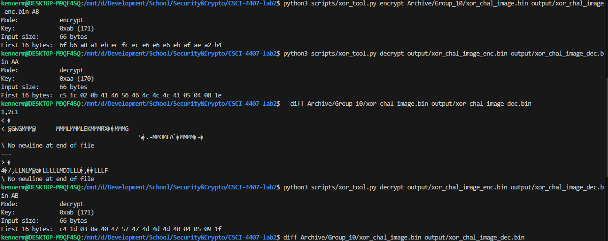
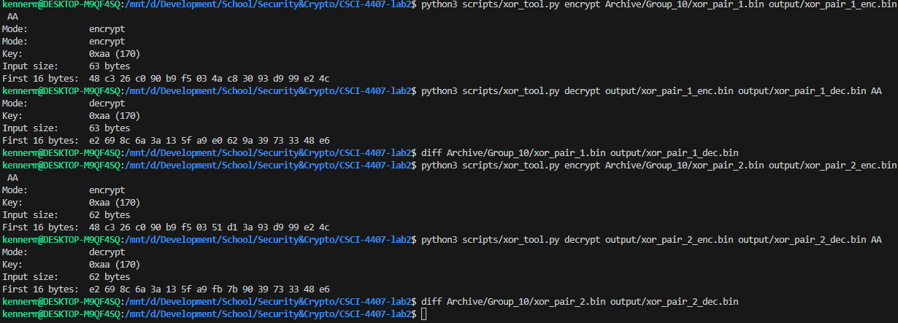

# Lab 2 — Modular Arithmetic and XOR-Based Encryption

**Course:** Security & Cryptography
**Date:** 02/16/2026
**Group Members:** Matthew Kenner, Cassius Kemp, Jonathan Le

---

## Task 1 — Build XOR Tool (20 pts)

### Source Code

```python
#!/usr/bin/env python3
"""Task 1 — XOR Encryption/Decryption Tool"""

import sys


def xor_file(mode, input_path, output_path, key):
    """XOR each byte of input file with key and write to output."""
    with open(input_path, "rb") as f:
        data = f.read()

    result = bytes(b ^ key for b in data)

    with open(output_path, "wb") as f:
        f.write(result)

    first16 = result[:16].hex(" ")
    print(f"Mode:            {mode}")
    print(f"Key:             0x{key:02x} ({key})")
    print(f"Input size:      {len(data)} bytes")
    print(f"First 16 bytes:  {first16}")


def main():
    if len(sys.argv) != 5:
        print(f"Usage: {sys.argv[0]} encrypt|decrypt <input> <output> <hex_key>")
        sys.exit(1)

    mode = sys.argv[1]
    input_path = sys.argv[2]
    output_path = sys.argv[3]
    key = int(sys.argv[4], 16)

    xor_file(mode, input_path, output_path, key)


if __name__ == "__main__":
    main()

```

### Screenshots






### Explanation of XOR Symmetry

XOR encryption and decryption use the same operation because XOR is self-inverse, meaning applying the same XOR operation twice with the same key restores the original data.

```
(P XOR K) XOR K
= P XOR (K XOR K)
= P XOR 0
= P
```
---

## Task 2 — Break XOR via Brute Force (25 pts)

### Source Code

```python
# [PASTE BRUTE FORCE SCRIPT HERE]
```

### Recovered Key

**Key:** [HEX VALUE]

### Recovered Plaintext

```
[PASTE RECOVERED PLAINTEXT HERE]
```

### Screenshots

[INSERT SCREENSHOT: Script execution showing brute force results]

[INSERT SCREENSHOT: Recovered plaintext output]

### Explanation of Scoring Logic

[EXPLAIN how your scoring function works — e.g. printable ASCII ratio, English word detection, character frequency analysis, etc.]

---

## Task 3 — Image Header Attack (20 pts)

### Key Recovery Explanation

**Known PNG header bytes:** `89 50 4E 47 0D 0A 1A 0A`

**First encrypted byte(s):** [HEX VALUE]

**Recovered key:** [HEX VALUE]

[EXPLAIN the XOR operation used to recover the key from the known header]

### Source Code

```python
# [PASTE KEY RECOVERY / DECRYPTION SCRIPT HERE]
```

### Verification Screenshots

[INSERT SCREENSHOT: Encrypted file hex inspection]

[INSERT SCREENSHOT: Decrypted PNG image opened successfully]

### Explanation of Known-Plaintext Attack

[EXPLAIN why knowing part of the plaintext allows recovery of the key, and why this is a fundamental weakness of XOR encryption]

---

## Task 4 — Two-Time Pad Attack (25 pts)

### XOR of Ciphertexts

```python
# [PASTE SCRIPT OR COMMAND USED TO XOR THE TWO CIPHERTEXT FILES]
```

### Recovered Plaintext Segments

| Offset | Crib Used | Recovered Text |
|--------|-----------|----------------|
| [OFFSET] | [WORD] | [RECOVERED SEGMENT] |
| [OFFSET] | [WORD] | [RECOVERED SEGMENT] |
| [OFFSET] | [WORD] | [RECOVERED SEGMENT] |

### Method and Reasoning

[EXPLAIN the crib dragging process — how you chose cribs, how you identified valid plaintext, and how you extended recovered segments]

### Explanation of Key Reuse Weakness

[EXPLAIN why reusing a one-time pad key (two-time pad) breaks security, i.e. C1 XOR C2 = P1 XOR P2, eliminating the key entirely]

---

## Key Lessons Learned

- [SUMMARIZE key takeaway about XOR reversibility]
- [SUMMARIZE key takeaway about small key spaces]
- [SUMMARIZE key takeaway about known-plaintext attacks]
- [SUMMARIZE key takeaway about key reuse]

---

## Appendix

### Full Script Listings

[OPTIONAL: Include complete scripts if not fully shown above]

### Additional Screenshots

[OPTIONAL: Include any additional supporting evidence]
